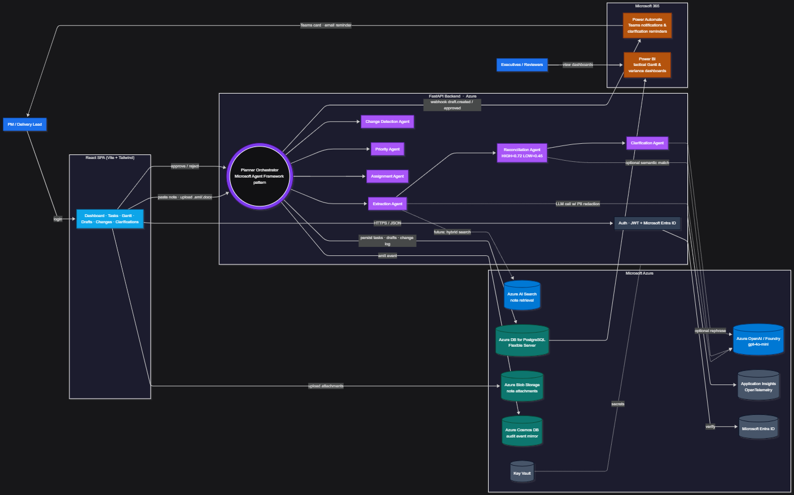
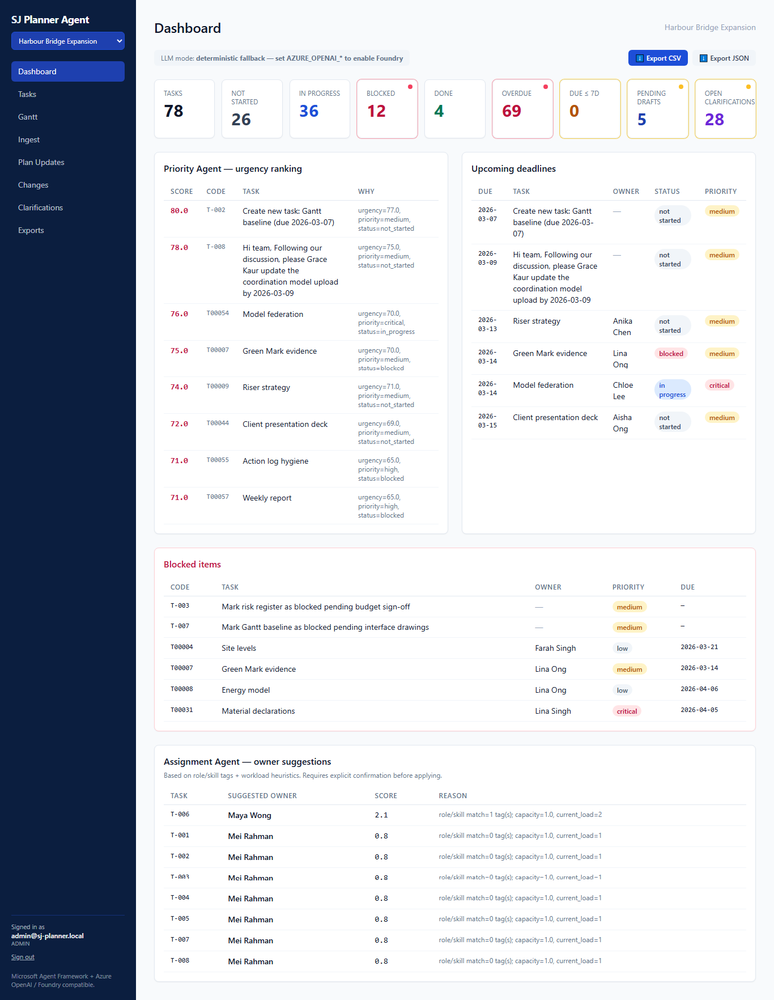
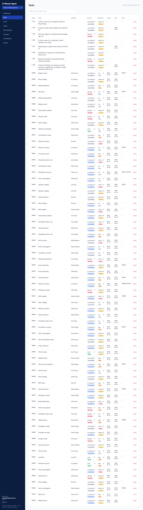
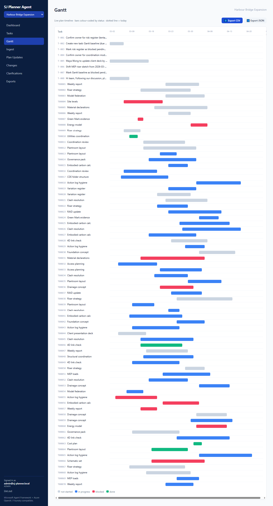
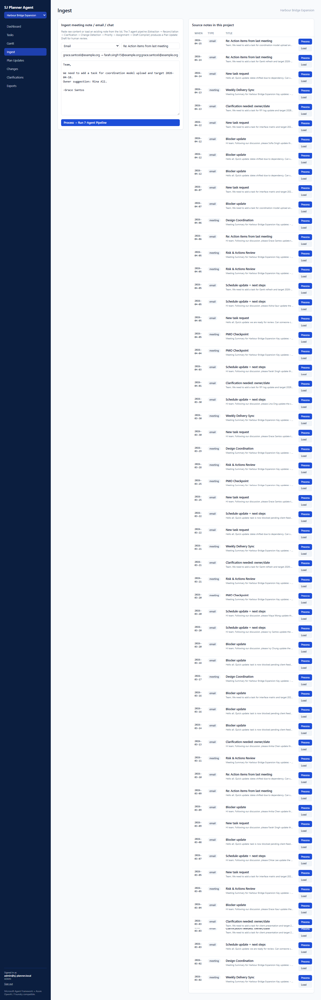
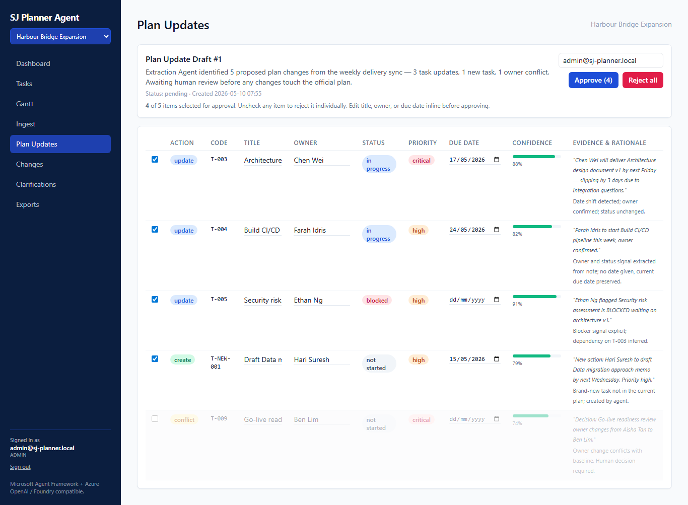
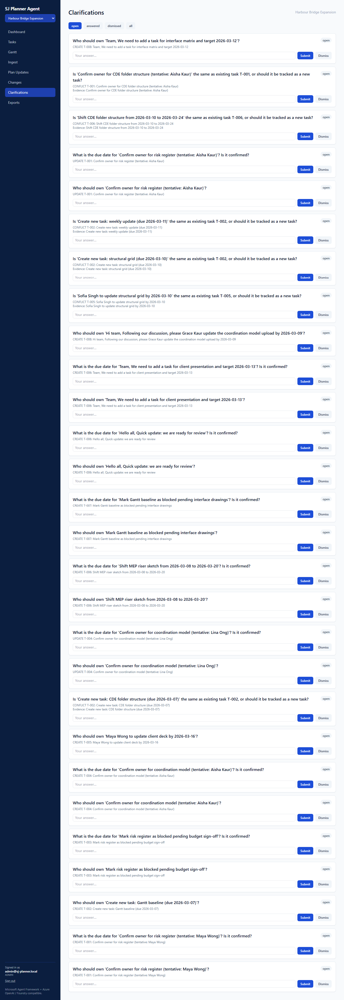

# SJ Project Planner Agent

> **Agentic AI for Task-Progress and Project Tracking**
> *SJ Group — Microsoft Foundry Hackathon submission*

In complex delivery environments, project plans drift away from reality
because the *truth* of what changed lives in meeting notes, emails and Teams
chats — not in the tracker. **SJ Project Planner Agent** closes that gap. Paste
a meeting note, and seven specialised agents — orchestrated using the
Microsoft Agent Framework sequential-workflow pattern and powered by Azure
OpenAI / Microsoft Foundry — extract action items, reconcile them against the
live plan, surface conflicts, and queue a human-approvable **Plan Update
Draft** with full evidence trail. Nothing touches the official plan without a
review.

---

## ✨ Features

- **7-agent pipeline** — Extraction · Reconciliation · Clarification · Change
  Detection · Priority · Assignment · Orchestrator
- **Plan Update Draft** with `create / update / conflict` labels, verbatim
  evidence quotes, confidence scores, and per-item human approval
- **Change log + baseline diff** — auditable record of every accepted change
- **Auto-generated clarifications** for missing owners, dates, or
  low-confidence items
- **Multi-tenant** (`org_id` scoping), JWT + **Microsoft Entra ID**, RBAC
  (`admin / pm / member / viewer`), rate limiting, PII redaction
- **React + Tailwind** SPA with Dashboard, Tasks, Gantt, Notes Ingest, Drafts,
  Changes, Clarifications
- **Power BI** dashboard model (`.bim`) + 7 RLS-ready SQL views
- **Power Automate** flows for Teams notifications (draft created/approved,
  clarification reminder)
- **Azure-native deployment** via one Bicep template + GitHub Actions OIDC CI/CD
- Runs **fully offline** when Azure creds are absent (deterministic fallback)
- **39 automated tests** + Alembic migrations baked into the container image

---

## 🏗 Architecture



> Render: open [`infra/architecture.mmd`](infra/architecture.mmd) at
> <https://mermaid.live> and export PNG, or
> `npx -p @mermaid-js/mermaid-cli mmdc -i infra/architecture.mmd -o docs/architecture.png -w 1920`.

---

## 📸 Screens

| Dashboard | Tasks | Gantt |
|---|---|---|
|  |  |  |

| Ingest | Plan Update Draft | Clarifications |
|---|---|---|
|  |  |  |

> See [`docs/SCREENSHOTS.md`](docs/SCREENSHOTS.md) for capture instructions
> (Win + Shift + S, or a 20-line Playwright script).

---

## 🚀 Quickstart (local, fully offline)

### Option 1 — Docker (simplest, works on all OS)

```bash
git clone https://github.com/<your-username>/sj-project-planner-agent.git
cd sj-project-planner-agent
docker compose up --build      # backend on :8000, frontend on :8080
```

### Option 2 — Native (Windows PowerShell)

> **Before you start:** PowerShell blocks scripts by default. Run this once to allow venv activation:
> ```powershell
> Set-ExecutionPolicy -ExecutionPolicy RemoteSigned -Scope CurrentUser
> ```

```powershell
git clone https://github.com/<your-username>/sj-project-planner-agent.git
cd sj-project-planner-agent

# --- Backend ---
cd backend
python -m venv .venv
.\.venv\Scripts\Activate.ps1        # PowerShell
# OR: .venv\Scripts\activate.bat    # Command Prompt (CMD)
pip install -r requirements.txt
python scripts/preload_demo.py      # seeds CWB_SJ dataset + sample drafts
uvicorn app.main:app --reload       # runs on http://localhost:8000

# --- Frontend (new terminal, from repo root) ---
cd ../frontend
npm install
npm run dev                         # runs on http://localhost:5173
```

### Option 3 — Native (macOS / Linux)

```bash
git clone https://github.com/<your-username>/sj-project-planner-agent.git
cd sj-project-planner-agent

# --- Backend ---
cd backend
python3 -m venv .venv
source .venv/bin/activate
pip install -r requirements.txt
python scripts/preload_demo.py      # seeds CWB_SJ dataset + sample drafts
uvicorn app.main:app --reload       # runs on http://localhost:8000

# --- Frontend (new terminal, from repo root) ---
cd ../frontend
npm install
npm run dev                         # runs on http://localhost:5173
```

Open <http://localhost:5173> and log in with the bootstrap admin
(`[email protected]` / `ChangeMe!123` — change in `.env` before any real use).

The demo seeds itself from the official **CWB_SJ** dataset:
4 projects · 281 tasks · 18 team members · 70+ meeting notes & emails ·
8 drafts · 38 clarifications.

---

## 🧠 Agent pipeline

| Agent | Input | Output | Notes |
|---|---|---|---|
| **Extraction** | meeting note + attendees | structured action items + evidence quote + confidence | LLM (`gpt-4o-mini`) → deterministic regex fallback |
| **Reconciliation** | extracted items + current plan | `create / update / conflict` per item | Token-overlap similarity, HIGH = 0.72, LOW = 0.45 |
| **Clarification** | reconciled items | targeted questions for missing/ambiguous fields | Always-on, no LLM |
| **Change Detection** | live plan vs. baseline snapshot | severity-tagged change list | Pure deterministic |
| **Priority** | live tasks | re-ranked by urgency × deps × status | Pure deterministic |
| **Assignment** | unassigned tasks + team capacity | suggested owner with reason | Skill-tag overlap + load heuristic |
| **Orchestrator** | a `MeetingNote` row | a persisted `PlanUpdateDraft` | Mirrors Microsoft Agent Framework sequential-workflow pattern |

---

## ☁️ Microsoft / Azure stack

| Service | Used for |
|---|---|
| **Microsoft Foundry / Azure OpenAI** (`gpt-4o-mini`) | Extraction & reasoning agents |
| **Microsoft Agent Framework** (pattern) | Orchestrator + sequential workflow |
| **Azure Container Apps** | FastAPI backend (auto-scale 1→5, managed identity) |
| **Azure DB for PostgreSQL Flexible Server** | System of record (Alembic migrations) |
| **Azure Blob Storage** | Note attachments (`.eml` / `.docx` / images) |
| **Azure Cosmos DB** | Append-only audit/event mirror |
| **Azure AI Search** | Hybrid retrieval over notes (config-ready) |
| **Microsoft Entra ID** | Production SSO (JWT + JWKS verification) |
| **Application Insights + Log Analytics** | OpenTelemetry tracing & structured logs |
| **Azure Key Vault** | Secrets referenced by Container App |
| **Power BI** | Dashboards (`infra/powerbi/`) |
| **Power Automate** | Teams notifications (`infra/power_automate/`) |
| **GitHub Actions + Azure OIDC** | CI tests + Bicep deploy + image roll |

Provision everything with:

```powershell
az deployment sub create --location southeastasia `
  --template-file infra/main.bicep `
  --parameters rgName=rg-sjplanner-prod pgPassword="<strong>" `
               backendImage="ghcr.io/<you>/sjplanner-api:latest"
```

See [`DEPLOYMENT.md`](DEPLOYMENT.md) for the full runbook (and lower-cost
alternatives like Render + Neon if you don’t need Azure).

---

## 🧪 Tests

Make sure the virtual environment is **activated** before running tests (see Quickstart above).

```powershell
# Windows PowerShell
cd backend
.\.venv\Scripts\Activate.ps1
pytest -q       # 39 passed
```

```bash
# macOS / Linux
cd backend
source .venv/bin/activate
pytest -q       # 39 passed
```

Coverage: agents, orchestrator, auth/RBAC, attachments, exports, webhooks,
PII redaction, baseline & change detection, priority ranking, multi-tenant
isolation.

---

## 📂 Repo layout

```
backend/        FastAPI app · 7 agents · Alembic · tests · scripts
frontend/       Vite + React + Tailwind SPA
infra/          Bicep · Power BI · Power Automate · architecture.mmd
.github/        CI + Azure OIDC deploy workflows
DEPLOYMENT.md   Production runbook
SUBMISSION.md   Hackathon form-ready text
PITCH_SCRIPT.md 5-minute video script
```

---

## 📄 License & dataset

Synthetic dataset: [DoreenSteven/CWB_SJ](https://github.com/DoreenSteven/CWB_SJ).
Code released under MIT for the hackathon submission.
 
